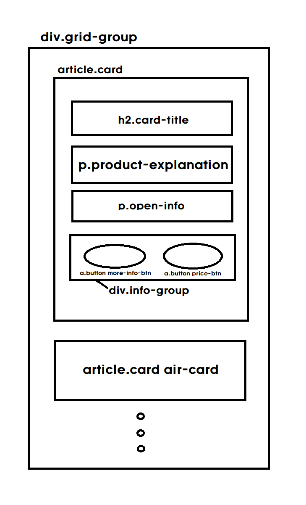
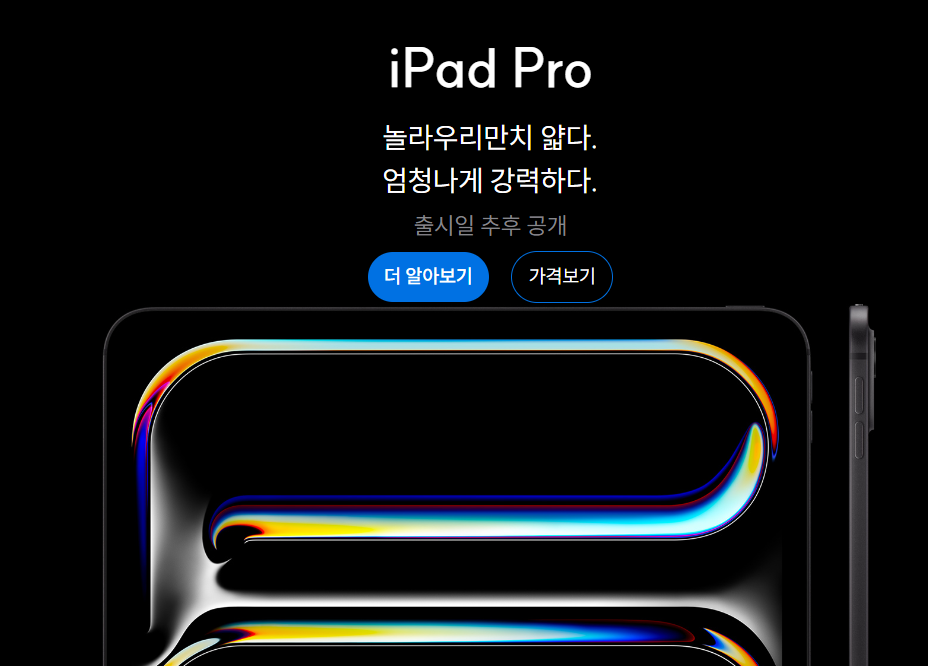

# apple 제품 카드

## 마크업


이번에는 카드 컴포넌트를 만들고 그것을 활용하여 레이아웃을 구성하는 과제였다.</br>
카드 컴포넌트를 구성하기 위해 article태그를 이용하였고 전체 레이아웃을 위해 div 태그를 이용하여 배치하였다. 카드 컴포넌트의 배경 이미지는 card 클래스에 직접 backgroud-image로 주었는데 이때문에 발생하는 문제가 있었다.(뒤에 문제1에서 설명)</br>

1. <span style="background-color:#E6E6FA">div.grid-group</span>: 그리드 레이아웃 배치를 위해 모든 카드 컴포넌트를 그룹핑할 수 있는 div 태그를 썼다.
2. <span style="background-color:#E6E6FA">article.card</span>: 카드 컴포넌트는 article 태그로 구성하였다.
3. <span style="background-color:#E6E6FA">h2.card-title</span>: 제품명을 설명할 수 있는 제목에 해당하는 요소는 h2태그를 이용하였다.
4. <span style="background-color:#E6E6FA">p.product-explanation</span>: 제품의 설명 문구는 p태그를 이용했다.
5. <span style="background-color:#E6E6FA">p.open-info</span>: 출시정보는 p태그를 사용했다.
6. <span style="background-color:#E6E6FA">div-info-group</span>: 제품 더 알아보기와 가격 정보를 알려주는 링크를 a태그를 이용하여 구현했고 이를 flex로 배치하기 위해 div로 그룹핑하였다.

## 접근성

```css
<a class="button more-info-btn" href="/" aria-label="아이폰 15에 대해 더 알아보기" aria-hidden="true">더 알아보기</a>
          <a class="button price-btn" href="/" aria-label="아이폰 15의 가격보기" aria-hidden="true">가격보기</a>
```

처음에 스크린리더로 페이지를 읽을 때, a태그에 지정한 텍스트인 "더 알아보기", "가격보기"로만 읽는 것을 확인할 수 있었다.<br/>
어떤 상품의 정보를 알려주는 링크인지를 설명할 수 있도록 aria-label을 이용하였고 기존의 텍스트는 읽지 않도록 뒤에 aria-hidden에 true값을 지정하였다.

## 반응형 css

카드 컴포넌트 자체 반응형은 height값은 500px로 고정하되 width값이 유동적으로 줄거나 늘어날 수 있도록 100%를 부여했다.

```css
@media (min-width: 1024px) {
  background-image: image-set(
    url(../products/ipad_pro_wide.jpeg) 1x,
    url(../products/ipad_pro_wide_2x.jpeg) 2x
  );
}
```

media-query를 이용하여 1024px이상의 화면에서는 ipad_pro_wide.jpeg가 보이도록 하였다.<br/>
텍스트가 커지도록 하는 것 역시 media-query를 이용하였다.

## grid 배치

소형 화면(1024px 미만)의 경우에는 flex로 열방향으로 배열되도록 처리하였는데 대형화면에서는 그리드를 이용하여 배치되도록 하였다.

```css
@media (min-width: 1024px) {
  .grid-group {
    display: grid;
    grid-template-columns: repeat(2, 1fr);
    grid-auto-rows: auto;
    gap: 12px;

    .cols-1 {
      grid-column: span 1;
    }
    .cols-2 {
      grid-column: span 2;
    }
  }
}
```

그리드 배치를 위해 cols-1는 열 하나를 차지하도록 설정하고, cols-2에 열 두 개를 모두 배치하도록 하였고 html 파일 내의 해당 컴포넌트가 원하는 대로 배치되도록 클래스를 부여했다.

## 문제1: 배경이미지 문제



> 다른 이미지를 적용할 때는 이러한 문제가 없는데 아이패드 프로 이미지만 링크 버튼과 상단 간격이 부족해보였다. 높이값을 고정해서 그런건가 싶은데 해결방법을 찾지 못했다.😭

<br/>

## 문제2: 링크 버튼 높이 문제


<br/>
처음에는 더 알아보기 버튼과 가격보기 버튼의 높이가 맞지 않아 고민했다. 버튼을 그룹핑한 info-group 클래스에 버튼 크기에 대한 제한은 없는 것 같아 line-height를 지정하여 높이를 같아보이도록 만들었다.
