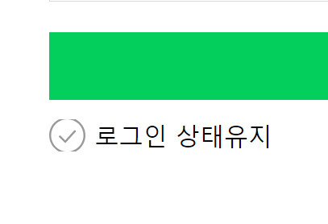
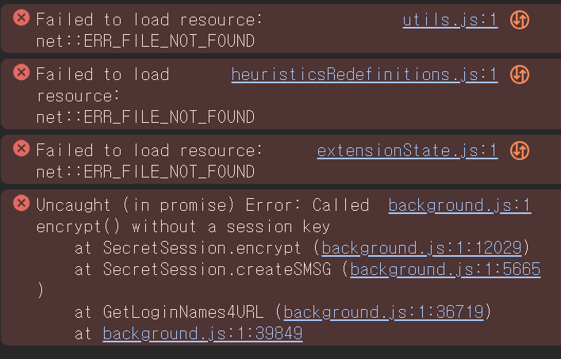
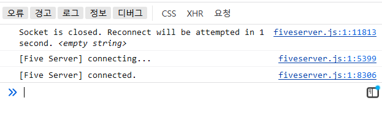
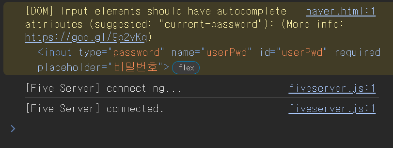

# 네이버 로그인 화면

### 문제1

> 배경이미지 크기 제한을 24px\*24px로 고정하니까 체크박스 이미지가 위아래 잘려보였다.


</br>
이 문제를 처음에는 체크박스 label에 padding을 주어서 억지로 해결하려고 했다.

### css

```css
.form-checkbox {
  label {
    display: block;
    --icon-size: 1.5rem;
    background: url(./icons/unchecked.svg) no-repeat 0 0 / contain;
    /* 24px(배경이미지길이)+5px(간격)=29px */
    /* 29px/16px = 1.8125rem */
    padding-left: 1.8125rem;
    height: 1.5rem;
    background-size: var(--icon-size) var(--icon-size);
    font-size: 1rem;
  }
}
```

다시 생각해보니 그냥 label을 블록 레벨로 만들어서 높이를 지정해주는 것이 더 효율적일 것 같아 이 방법으로 해결했다.
</br></br>

> 이번 과제에서 가장 고민된 부분...IP 보안을 켜고 끌 수 있는 토글을 만드려고 button 타입의 input을 선언해서 javascript로 버튼 토글을 만들었다.

### HTML

```html
<input
  type="button"
  value="off"
  class="on-off-btn"
  id="onOffBtn"
  onclick="onOffHandler()"
/>
```

버튼 타입의 input을 선언하여 클릭하면 onOffHandler 함수를 호출하도록 했다.

### Javasvript

```javascript
function onOffHandler() {
  const target = document.querySelector('#onOffBtn');
  if (target.value === 'off') {
    target.value = 'on';
    target.style.color = '#03cf5d';
  } else {
    target.value = 'off';
    target.style.color = '#181818';
  }
}
```

html내에서 script 태그를 통해 javascript로 토글을 만들었다.
html에서 아이디 onOffBtn에 해당하는 요소를 target에 지정하여 조건문 if를 사용해 off 일경우 value값을 on으로, off가 아닐 경우 off로 변경하고 이 때 색상도 변경하도록 하였다.

### CSS

```css
.on-off-btn {
  border: none;
  background-color: transparent;
  font-size: var(--text-size);
  text-transform: uppercase;
  padding: 0;
}
```

CSS로 배경을 투명하게 바꾸기, 폰트 사이즈를 16px로 바꾸고 소문자 대문자로 바꾸는 작업을 한 뒤 확인해보니 마음에 들지 않는 점이 나타났다.

### 문제2

</br>
콘솔 내에서 자꾸 ERR_FILE_NOT_FOUND 에러가 발생했다.</br>
</br>
그런데 이것도 파이어폭스에서는 문제가 발생하지 않았다. 크롬 내에서의 문제일 것 같아서 열심히 구글링 해보았다.
</br>
</br>
찾아보니, 이는 크롬 확장 프로그램으로 인한 오류이며 확장 프로그램을 모두 꺼두었더니 위의 사진처럼 해결되었다. 야호ㅎㅎ</br>

[출처](https://kinsta.com/knowledgebase/err_file_not_found/#3-ways-to-fix-the-err_file_not_found-error)
